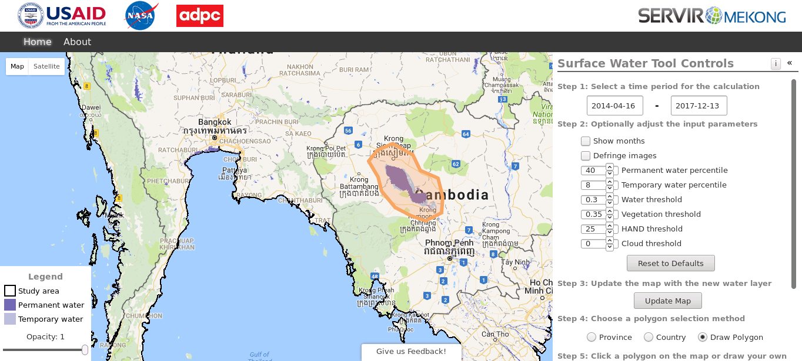

# Surface Water Mapping Tool
A web application for the water detection algorithm of <a href="https://servir.adpc.net/">SERVIR-Mekong</a> using Google Earth Engine and App Engine. The tool is part of the  <a href="https://servir.adpc.net/tools">SERVIR-Mekong Decision Support Tools</a> and has a dedicated page there as well: <a href="https://servir.adpc.net/tools/surface-water-mapping-tool">https://servir.adpc.net/tools/surface-water-mapping-tool</a>. The application itself can be found at <a href="http://surface-water-servir.adpc.net/">http://surface-water-servir.adpc.net/</a>.

A User Guide and Background Documentation are included in the About page of the tool.

The export functionality of this tool is still under development. Users are able to download data directly from a browser, but the area for which data can be downloaded is limited. Efforts are underway to allow an export to Google Drive, which would not have this limitation.

Dependencies are:
- ee
- httplib2
- oauth2client 

The Python and JavaScript client libraries for calling the Earth Engine API can be found here: <a  href="https://github.com/google/earthengine-api/">https://github.com/google/earthengine-api</a>. More information about Google Earth Engine is listed here: <a href="https://developers.google.com/earth-engine/">https://developers.google.com/earth-engine</a>.

# Development and Acknowledgement
The development of the algorithm using Landsat 8 data was initiated in the PhD research of Gennadii Donchyts (co-funded by Deltares and the Technical University of Delft). Testing and further development of the algorithm using the Murray-Darling basin in Australia was funded by the EC FP7 project eartH2Observe (under grant agreement No 603608), which led to the publication of Donchyts et al. (2016), see below.

Application to the Mekong basin, which included testing, applying and adjusting thresholds, as well as further optimisation of the scripts to fully take advantage of Google Earth Engine capabilities, was supported by the SERVIR-Mekong project. This also included the addition of data from Landsat 4, 5 and 7. The development of the method to calculate the HAND dataset was fully supported by the eartH2Observe project, but the application for the Mekong, as well as refinement for this area, was supported by the SERVIR-Mekong project.

Landsat data is made freely available by the U.S. Geological Survey (USGS) and is both accessed and processed in Google Earth Engine.

The creation of the Google Appspot based online application was fully supported by the SERVIR-Mekong project.

# References
<a href="http://www.mdpi.com/2072-4292/8/5/386">Gennadii, D., Schellekens, J., Winsemius, H., Eisemann, E. & van de Giesen, N. (2016). A 30 m Resolution Surface Water Mask Including Estimation of Positional and Thematic Differences Using Landsat 8, SRTM and OpenStreetMap: A Case Study in the Murray-Darling Basin, Australia. Remote Sensing, 8(5), 386.</a>

<a href="http://www.sciencedirect.com/science/article/pii/S003442570800120X">Rennó, C. D., Nobre, A. D., Cuartas, L. A., Soares, J. V., Hodnett, M. G., Tomasella, J., & Waterloo, M. J. (2008). HAND, a new terrain descriptor using SRTM-DEM: Mapping terra-firme rainforest environments in Amazonia. Remote Sensing of Environment, 112(9), 3469-3481.</a>

<a href="http://doi.org/10.1080/01431160600589179">Xu, H. (2006). Modification of normalised difference water index (NDWI) to enhance open water features in remotely sensed imagery. International Journal of Remote Sensing, 27(14), 3025–3033. doi: 10.1080/01431160600589179.</a>

<a href="http://onlinelibrary.wiley.com/doi/10.1002/2017GL072874/full">Yamazaki D., D. Ikeshima, R. Tawatari, T. Yamaguchi, F. O'Loughlin, J.C. Neal, C.C. Sampson, S. Kanae & P.D. Bates. (2017). A high accuracy map of global terrain elevations. Geophysical Research Letters, vol.44, pp.5844-5853. doi: 10.1002/2017GL072874.</a>

