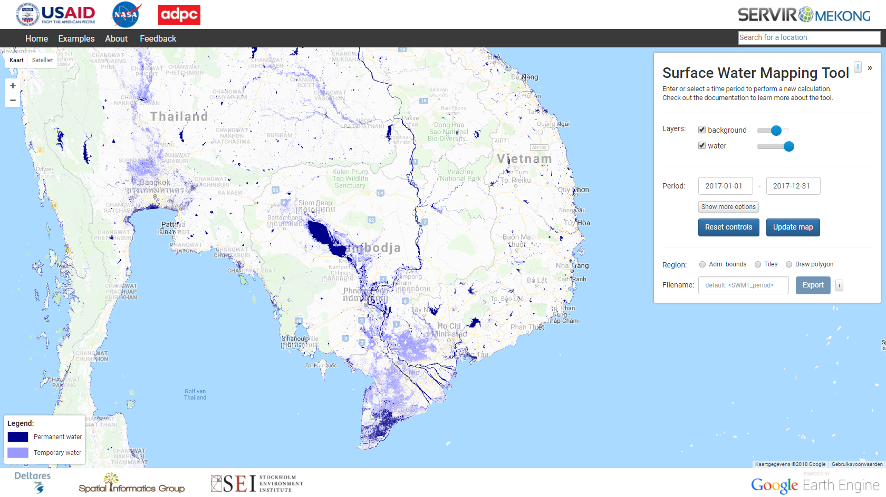

# SurfaceWaterTool

A web application for the water detection algorithm of SERVIR-Mekong using
Google Earth Engine and App Engine. The application itself can be found at
[http://surface-water.appspot.com](http://surface-water.appspot.com). The Python
and JavaScript client libraries for calling the Earth Engine API can be found
[here](https://github.com/google/earthengine-api). More information about Google
Earth Engine is listed [here](https://developers.google.com/earth-engine).



This tool is still in development. The two most important additions will be:
- Export data within drawn region to Google Drive
- Demo to help users understand the application

The SurfaceWaterTool was developed, in part, by checking out the code of one
of the Earth Engine application demos at [https://github.com/google/earthengine-api/tree/master/demos/export-to-drive](https://github.com/google/earthengine-api/tree/master/demos/export-to-drive).

## Installation

1. Clone this repository
2. Install Python 2.7
3. Install these Python libs:
   * ee
   * httplib2
   * oauth2client
4. Install the [Google Cloud SDK for Python](https://cloud.google.com/appengine/docs/python/download)
5. Install Java Development Kit 1.8+
6. Install [Boot](http://boot-clj.com)

## Running

First, you need to build surface-water.js from the Clojurescript files in cljs:

```bash
$ cd cljs
$ boot prod
```

Now return to the toplevel directory and launch the Google App Engine
development server:

```bash
$ cd ..
$ dev_appserver.py .
```

Your application is now live at: [http://localhost:8080](http://localhost:8080)
